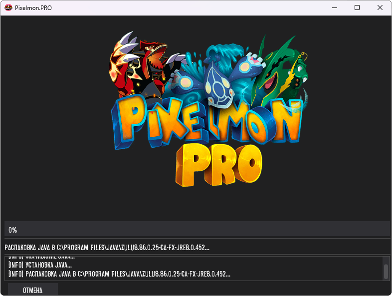

# Pixelmon.PRO Pre-Launcher 🚀

[](https://creativecommons.org/licenses/by-nc-sa/4.0/)
[](https://python.org)
[](https://windows.com)



Кроссплатформенный лаунчер для проекта Pixelmon.PRO с автоматической установкой Java и обновлениями.

## 🌟 Основные функции
- 🔄 Автоматическая установка Java (Zulu JRE 8)
- 🖼️ Современный GUI на базе DearPyGui
- 🌍 Поддержка русского/английского языков
- 📦 Самодостаточный исполняемый файл (1 EXE)
- 🔒 Проверка целостности файлов через SHA-256
- 📊 Индикатор прогресса установки в реальном времени
- 🛡️ Проверка прав администратора

## 📋 Системные требования
- **ОС:** Windows 7/8/10/11 (64-bit)
- **Место на диске:** 2 ГБ
- **Интернет:** Требуется для загрузки компонентов
- **Права:** Администратор для установки Java

## 🛠️ Установка и сборка

### 💾 Из готового релиза:
1. Скачайте `PreLauncher.exe` из [раздела релизов](https://github.com/TeamPixelmonPRO/pre-launcher/releases)
2. Запустите файл (желательно от имени администратора)
3. Дождитесь установки и запуска лаунчера

### 🔧 Сборка из исходников:

```bash
# Клонировать репозиторий
git clone https://github.com/TeamPixelmonPRO/pre-launcher.git
cd pre-launcher

# Установить зависимости
pip install -r requirements.txt

# Собрать исполняемый файл
pyinstaller prelauncher.spec
```

## 🔄 Рабочий процесс
1. Запуск PreLauncher.exe
2. Проверка наличия Java нужной версии
3. Автоматическая загрузка и установка Java (при необходимости)
4. Проверка целостности файлов лаунчера
5. Подготовка рабочего окружения
6. Запуск основного приложения
7. Автоматическая очистка временных файлов

## 📜 Лицензия
Проект распространяется под лицензией [CC BY-NC-SA 4.0](https://creativecommons.org/licenses/by-nc-sa/4.0/).

**Разрешено:**
- Использовать и модифицировать код
- Создавать некоммерческие производные продукты

**Обязательно:**
- Указание оригинального авторства
- Сохранение лицензии в производных работах

**Запрещено:**
- Коммерческое использование
- Удаление информации об авторе
- Распространение без указания изменений

---

# Pixelmon.PRO Pre-Launcher 🚀

[](https://creativecommons.org/licenses/by-nc-sa/4.0/)
[](https://python.org)
[](https://windows.com)


Cross-platform launcher for Pixelmon.PRO project with automatic Java installation and updates.

## 🌟 Key Features
- 🔄 Automatic Java Runtime Installation (Zulu JRE 8)
- 🖼️ Modern GUI using DearPyGui
- 🌍 Dual Language Support (EN/RU)
- 📦 Single Executable Deployment (1 EXE)
- 🔒 SHA-256 File Integrity Verification
- 📊 Real-time Progress Tracking
- 🛡️ Administrator Rights Check

## 📋 System Requirements
- **OS:** Windows 7/8/10/11 (64-bit)
- **Storage:** 2 GB available space
- **Internet:** Required for components download
- **Permissions:** Administrator rights for Java installation

## 🛠️ Installation & Build

### 💾 From Release:
1. Download `PreLauncher.exe` from [Releases](https://github.com/TeamPixelmonPRO/pre-launcher/releases)
2. Run as Administrator
3. Follow on-screen instructions

### 🔧 Build from Source:

```bash
# Clone repository
git clone https://github.com/TeamPixelmonPRO/pre-launcher.git
cd pre-launcher

# Install dependencies
pip install -r requirements.txt

# Build executable
pyinstaller prelauncher.spec
```

## 🔄 Workflow
1. Launch PreLauncher.exe
2. Check for required Java version
3. Automatically download/install Java if needed
4. Verify launcher files integrity
5. Prepare runtime environment
6. Launch main application
7. Cleanup temporary files

## 📜 License
This project is licensed under [CC BY-NC-SA 4.0](https://creativecommons.org/licenses/by-nc-sa/4.0/).

**Allowed:**
- Use and modify code
- Create non-commercial derivatives

**Required:**
- Original authorship attribution
- License preservation in derivatives

**Forbidden:**
- Commercial use
- Removal of authorship information
- Distribution without change disclosure

---

> **Maintainers**  
> Pixelmon.PRO Development Team  
> 📧 Contact: [admin@pixelmon.pro](mailto:admin@pixelmon.pro)  
> 🌐 Website: [https://pixelmon.pro](https://pixelmon.pro)